A full stack finance management application buit with pyrhon streamlit and MongoDB

**Project Title**
**Expense Tracking System**
> _"Track every rupee. Control every decision."_

---

## 📖 About the Project

The **Expense Tracking System** is a web-based personal finance application that enables users to record, monitor, analyze, and manage their daily expenses and income. Built using **Python Streamlit** for the front-end and **MongoDB** as the back-end database, this application provides a seamless, real-time financial dashboard.

The system allows users to:
- Add and categorize income and expenses
- View monthly/weekly spending summaries
- Analyze spending trends through interactive charts
- Set budgets and receive overspending alerts
- Filter, search, and export transaction history

This project was developed as a full-stack solution demonstrating the integration of a reactive Python UI framework with a NoSQL document database, making it both scalable and easy to maintain.

---

## 🎯 Purpose / Advantages / Applications

### 🔵 Purpose
Managing personal finances is a challenge for millions of people. This system provides a **simple, intuitive interface** to help individuals:
- Keep track of where their money is going
- Identify unnecessary spending habits
- Plan budgets effectively
- Make informed financial decisions

### ✅ Advantages

| Advantage | Description |
|-----------|-------------|
| 📊 **Visual Analytics** | Interactive charts and graphs for spending insights |
| 🗂️ **Category Management** | Organize expenses into Food, Transport, Bills, Health, etc. |
| ⚡ **Real-time Updates** | Streamlit re-renders UI instantly on data changes |
| 🔒 **Secure Storage** | MongoDB stores data persistently and securely |
| 🌐 **Web-based** | Accessible from any browser, no installation needed by end users |
| 📱 **Responsive UI** | Works on desktop and mobile browsers |
| 📤 **Data Export** | Download expense reports as CSV |
| 🔔 **Budget Alerts** | Notifies when spending exceeds set limits |

### 🏭 Applications

- **Personal Finance Management** — Track daily household expenses
- **Student Budget Planner** — Monitor hostel and college expenses
- **Small Business Bookkeeping** — Record petty cash and daily transactions
- **Family Expense Manager** — Shared family financial tracking
- **Freelancer Income/Expense Tracker** — Track project earnings and deductions

---

## 🛠️ Tech Stack

### 🎨 Front-End Technologies

#### i) Python Streamlit

| Component | Details |
|-----------|---------|
| **Framework** | Streamlit 1.x |
| **Language** | Python 3.9+ |
| **UI Components** | st.sidebar, st.columns, st.metric, st.dataframe, st.plotly_chart |
| **Charts** | Plotly Express (bar, pie, line charts) |
| **Forms** | st.form, st.selectbox, st.date_input, st.number_input |
| **State Management** | st.session_state |

**Why Streamlit?**
- Zero HTML/CSS/JS needed — pure Python
- Rapid prototyping and deployment
- Built-in widgets (sliders, date pickers, file uploaders)
- Auto-reloading on code changes
- Easy integration with data science libraries (Pandas, Plotly)

---

### 🗄️ Back-End Technologies

#### i) MongoDB

| Component | Details |
|-----------|---------|
| **Database** | MongoDB (NoSQL, Document-based) |
| **Driver** | PyMongo 4.x |
| **Hosting** | MongoDB Atlas (Cloud) or Local MongoDB |
| **Collections** | `users`, `transactions`, `categories`, `budgets` |
| **Query Language** | MongoDB Query Language (MQL) |
| **Indexing** | Indexed on `user_id`, `date`, `category` |

**Why MongoDB?**
- Flexible schema — easy to add fields without migration
- JSON-like documents match Python dictionaries perfectly
- Horizontal scalability for large datasets
- Rich query capabilities with aggregation pipelines
- Free tier available on MongoDB Atlas

---

## 📐 E-R Diagram (Entity-Relationship Diagram)

```
┌─────────────────────────────────────────────────────────────────────────────┐
│                        E-R DIAGRAM — EXPENSE TRACKING SYSTEM                │
└─────────────────────────────────────────────────────────────────────────────┘

  ┌──────────────┐          ┌───────────────────┐          ┌────────────────┐
  │    USERS     │          │   TRANSACTIONS    │          │   CATEGORIES   │
  ├──────────────┤          ├───────────────────┤          ├────────────────┤
  │ _id (PK)     │──────┐   │ _id (PK)          │   ┌──────│ _id (PK)       │
  │ username     │      └──▶│ user_id (FK)      │   │      │ name           │
  │ email        │          │ category_id (FK)  │◀──┘      │ type           │
  │ password     │          │ amount            │          │ icon           │
  │ created_at   │          │ type (income/exp) │          │ color          │
  │ profile_pic  │          │ description       │          └────────────────┘
  └──────────────┘          │ date              │
          │                 │ payment_method    │          ┌────────────────┐
          │                 │ receipt_img       │          │    BUDGETS     │
          │                 └───────────────────┘          ├────────────────┤
          └────────────────────────────────────────────────│ _id (PK)       │
                                                          │ user_id (FK)   │
                                                          │ category_id    │
                                                          │ limit_amount   │
                                                          │ month          │
                                                          │ year           │
                                                          │ spent_amount   │
                                                          └────────────────┘

  RELATIONSHIPS:
  ┌─────────────────────────────────────────────────────────┐
  │  USER         ──< TRANSACTIONS  (One-to-Many)           │
  │  USER         ──< BUDGETS       (One-to-Many)           │
  │  CATEGORY     ──< TRANSACTIONS  (One-to-Many)           │
  │  CATEGORY     ──< BUDGETS       (One-to-Many)           │
  └─────────────────────────────────────────────────────────┘
```

---

## 🔄 Data Flow Diagram (DFD)

### Level 0 — Context Diagram
```
                        ┌───────────────────────────────┐
                        │                               │
   User Input ─────────▶│   EXPENSE TRACKING SYSTEM    │─────────▶ Reports/Dashboard
                        │                               │
   Login/Register ─────▶│                               │─────────▶ Alerts/Notifications
                        └───────────────────────────────┘
```

### Level 1 — DFD
```
┌─────────────────────────────────────────────────────────────────────────────┐
│                          LEVEL 1 DATA FLOW DIAGRAM                          │
└─────────────────────────────────────────────────────────────────────────────┘

         ┌──────────┐
         │  USER    │
         └────┬─────┘
              │
    ┌─────────▼──────────┐        ┌──────────────────┐
    │  1.0 AUTHENTICATE  │◀──────▶│   USERS Collection│
    │  (Login/Register)  │        │   (MongoDB)       │
    └─────────┬──────────┘        └──────────────────┘
              │ Valid Session
              │
    ┌─────────▼──────────────────────────────────────────┐
    │                  STREAMLIT DASHBOARD                 │
    │  ┌───────────────┐    ┌────────────────────────┐   │
    │  │ 2.0 ADD       │    │ 3.0 VIEW TRANSACTIONS  │   │
    │  │ TRANSACTION   │    │ (Filter, Search, Sort) │   │
    │  └──────┬────────┘    └──────────┬─────────────┘   │
    │         │                        │                  │
    │  ┌──────▼────────┐    ┌──────────▼─────────────┐   │
    │  │ 4.0 BUDGET    │    │ 5.0 ANALYTICS          │   │
    │  │ MANAGEMENT    │    │ (Charts & Reports)     │   │
    │  └──────┬────────┘    └──────────┬─────────────┘   │
    └─────────┼────────────────────────┼─────────────────┘
              │                        │
              ▼                        ▼
    ┌──────────────────────────────────────────────┐
    │            MONGODB DATABASE                  │
    │  ┌──────────────┐  ┌────────────────────┐   │
    │  │ transactions │  │     budgets        │   │
    │  │ collection   │  │     collection     │   │
    │  └──────────────┘  └────────────────────┘   │
    │  ┌──────────────┐  ┌────────────────────┐   │
    │  │  categories  │  │       users        │   │
    │  │  collection  │  │     collection     │   │
    │  └──────────────┘  └────────────────────┘   │
    └──────────────────────────────────────────────┘
              │
              ▼
    ┌─────────────────────┐
    │ 6.0 EXPORT / REPORT │──▶  CSV Download / PDF
    └─────────────────────┘

  DATA FLOWS:
  ──────────────────────────────────────────────────
  User ──▶ 1.0: credentials (username, password)
  1.0 ──▶ DB: query user record
  DB  ──▶ 1.0: user data / auth token
  User ──▶ 2.0: transaction (amount, category, date, type)
  2.0 ──▶ DB: INSERT transaction document
  DB  ──▶ 3.0: READ all transactions for user
  3.0 ──▶ 5.0: filtered data for charts
  5.0 ──▶ User: visual charts (pie, bar, line)
  User ──▶ 4.0: budget limit per category
  4.0 ──▶ DB: UPSERT budget document
  DB  ──▶ 4.0: current spent vs limit
  4.0 ──▶ User: alert if overspent
```

---

## 🖥️ Running Project Screenshots

> The following describes the screens of the running application:

### Screen 1 — Login / Register Page
```
┌─────────────────────────────────────────────────┐
│  💸 Expense Tracker                             │
│  ─────────────────────────────────────────────  │
│  Welcome Back!                                  │
│                                                 │
│  Username:  [_________________________]         │
│  Password:  [_________________________]         │
│                                                 │
│  [    SignIn  ]   [   SignUP   ]             │
└─────────────────────────────────────────────────┘
```

### Screen 2 — Dashboard (Home)
```
┌─────────────────────────────────────────────────────────────────┐
│ 💸 Expense Tracker         |  👤 John Doe     [Logout]          │
│─────────────────────────────────────────────────────────────────│
│ 📊 May 2026 Summary                                             │
│ ┌──────────────┐  ┌──────────────┐  ┌──────────────┐           │
│ │ Total Income │  │Total Expense │  │   Balance    │           │
│ │  ₹45,000     │  │  ₹28,500     │  │  ₹16,500     │           │
│ └──────────────┘  └──────────────┘  └──────────────┘           │
│                                                                  │
│  [Pie Chart: Expense by Category]  [Bar Chart: Monthly Trend]   │
│                                                                  │
│  Recent Transactions                                            │
│  ┌────────────────────────────────────────────────────────┐    │
│  │ 26 May  │ 🍕 Food        │ -₹450   │ Zomato Order      │    │
│  │ 25 May  │ 🚌 Transport   │ -₹120   │ Auto Rickshaw     │    │
│  │ 25 May  │ 💰 Salary      │ +₹45000 │ Monthly Salary    │    │
│  └────────────────────────────────────────────────────────┘    │
└─────────────────────────────────────────────────────────────────┘
```

### Screen 3 — Add Transaction
```
┌─────────────────────────────────────────────┐
│  ➕ Add New Transaction                      │
│  ──────────────────────────────────────────  │
│  Type:      [● Expense  ○ Income]            │
│  Amount:    [  1200  ] ₹                    │
│  Category:  [ Food & Dining  ▼ ]            │
│  Date:      [ 27/05/2026     ]              │
│  Payment:   [ UPI            ▼ ]            │
│  Note:      [ Dinner at restaurant ]        │
│                                              │
│            [ ✅ Add Transaction ]            │
└─────────────────────────────────────────────┘
```

### Screen 4 — Budget Manager
```
┌──────────────────────────────────────────────────────┐
│  🎯 Budget Manager — May 2026                        │
│  ────────────────────────────────────────────────── │
│  Food & Dining                                       │
│  ████████████░░░░░░  ₹4,200 / ₹6,000  (70%)         │
│                                                      │
│  Transport                                           │
│  ██████████████████  ₹3,500 / ₹3,000  ⚠️ OVERSPENT  │
│                                                      │
│  Entertainment                                       │
│  ████░░░░░░░░░░░░░░  ₹800 / ₹2,000   (40%)          │
└──────────────────────────────────────────────────────┘
```

### Screen 5 — Analytics
```
┌──────────────────────────────────────────────────────────┐
│  📈 Analytics & Reports                                  │
│  ──────────────────────────────────────────────────────  │
│                                                          │
│  Filter: [Jan ▼] to [May ▼] [2026 ▼]  [Apply]          │
│                                                          │
│  ┌──────────────────────────────────────────────────┐   │
│  │         Monthly Income vs Expense (Bar Chart)    │   │
│  │  ██ Income  ██ Expense                           │   │
│  │  Jan  Feb  Mar  Apr  May                        │   │
│  └──────────────────────────────────────────────────┘   │
│                                                          │
│  ┌──────────────────────────────────────────────────┐   │
│  │         Spending by Category (Pie Chart)         │   │
│  │  🟢 Food 35%  🔵 Transport 20%  🟡 Bills 25%    │   │
│  └──────────────────────────────────────────────────┘   │
│                                                          │
│  [ 📥 Download CSV Report ]                             │
└──────────────────────────────────────────────────────────┘
```

---

## 💻 All Source Code

### 📁 Project Structure
```
expense-tracking-system/
│
├── Home.py                  # Main Streamlit application entry point and Project Details
│
├── pages/
│   ├── Login.py        #In this page Sigin and Signup form available
│   ├── Profile.py      # change password and see profile details are available
│   ├── Add Transactions.py     Add income/expense form# View/filter all transactions
│   ├── Reports.py           # Data Visulisation
│   
│
├── .streamlit
│   ├── config.toml             # work as CSS and Provide my website Color 
│          
```

---

### 📄 `requirements.txt`
```txt
streamlit==1.32.0
pymongo==4.6.1
python-dotenv==1.0.0
plotly==5.19.0
pandas==2.2.0
Pillow==10.2.0
matplotlib==3.10.8
streamlit-lottie==0.0.5
```


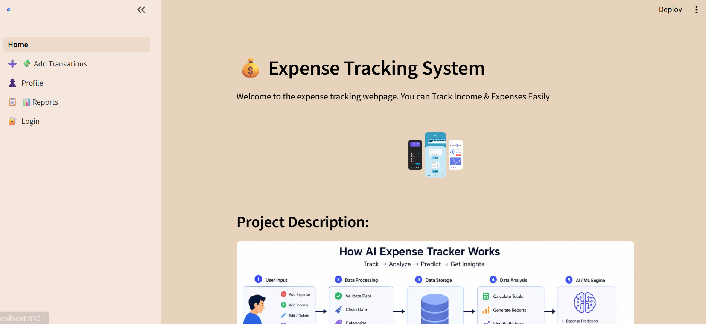
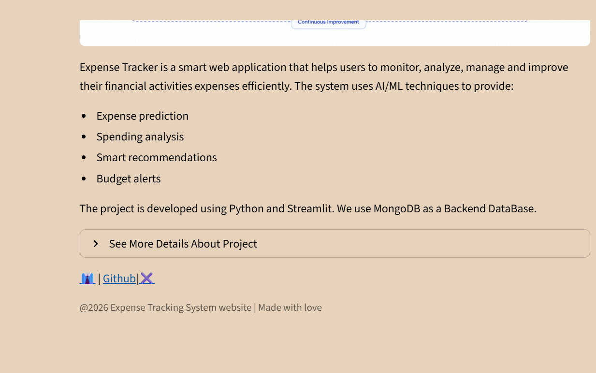
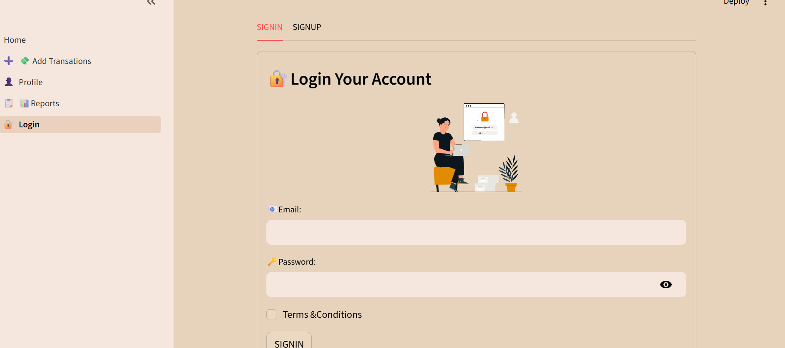
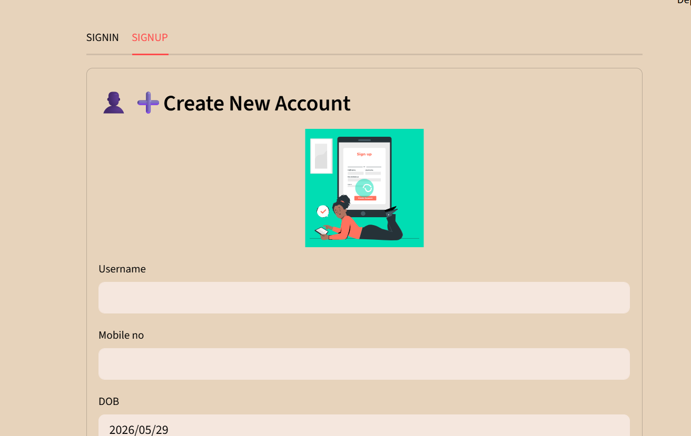
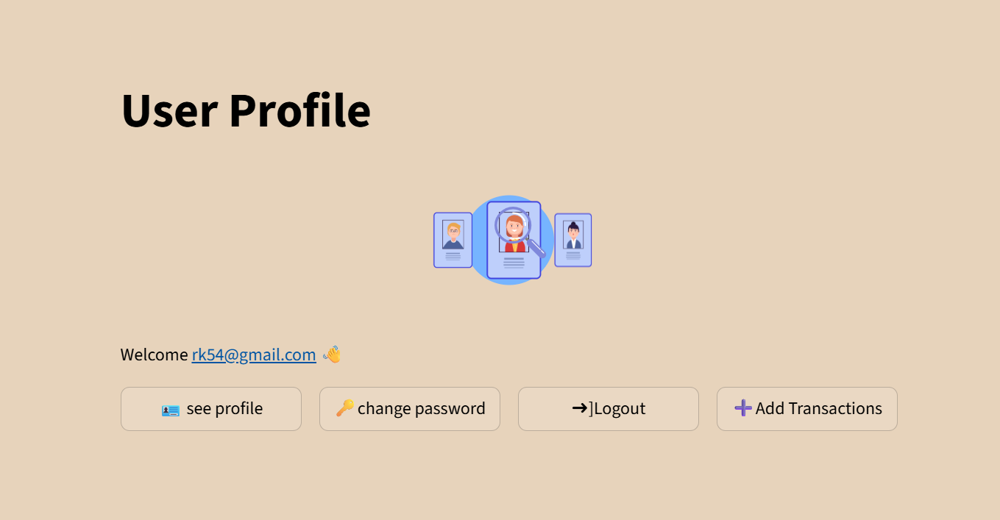
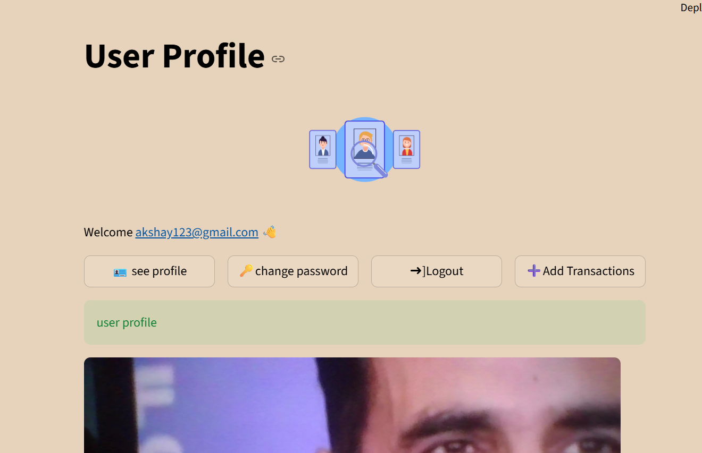
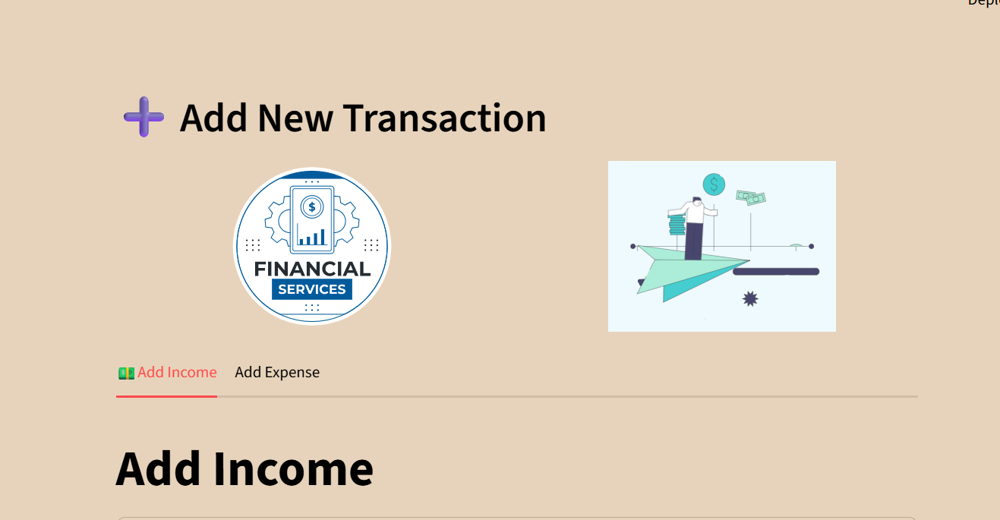

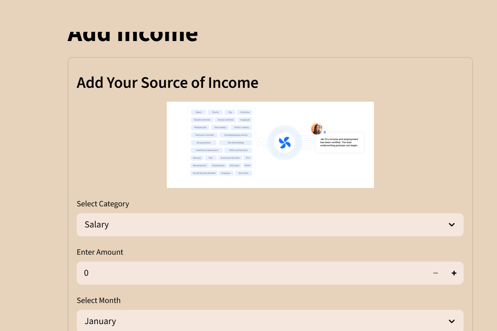
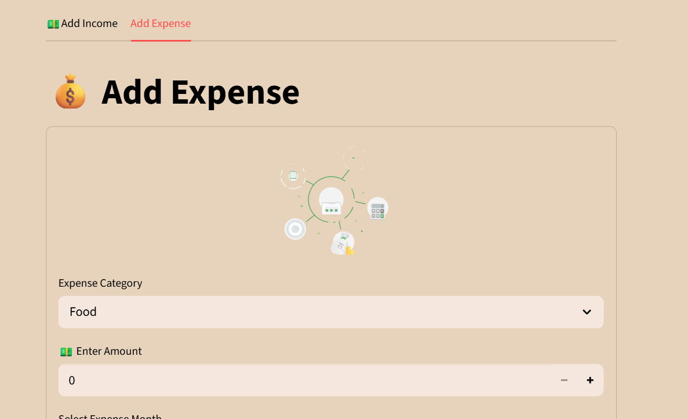

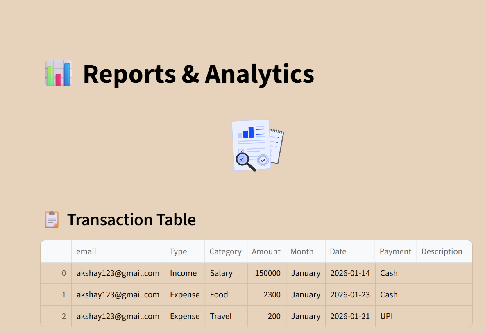
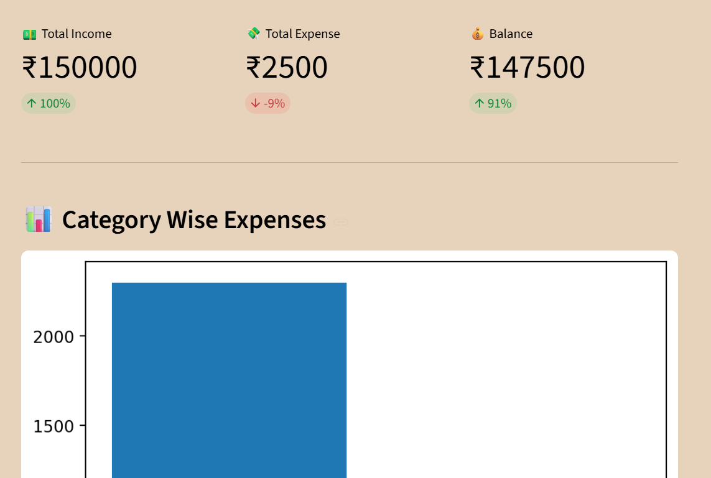
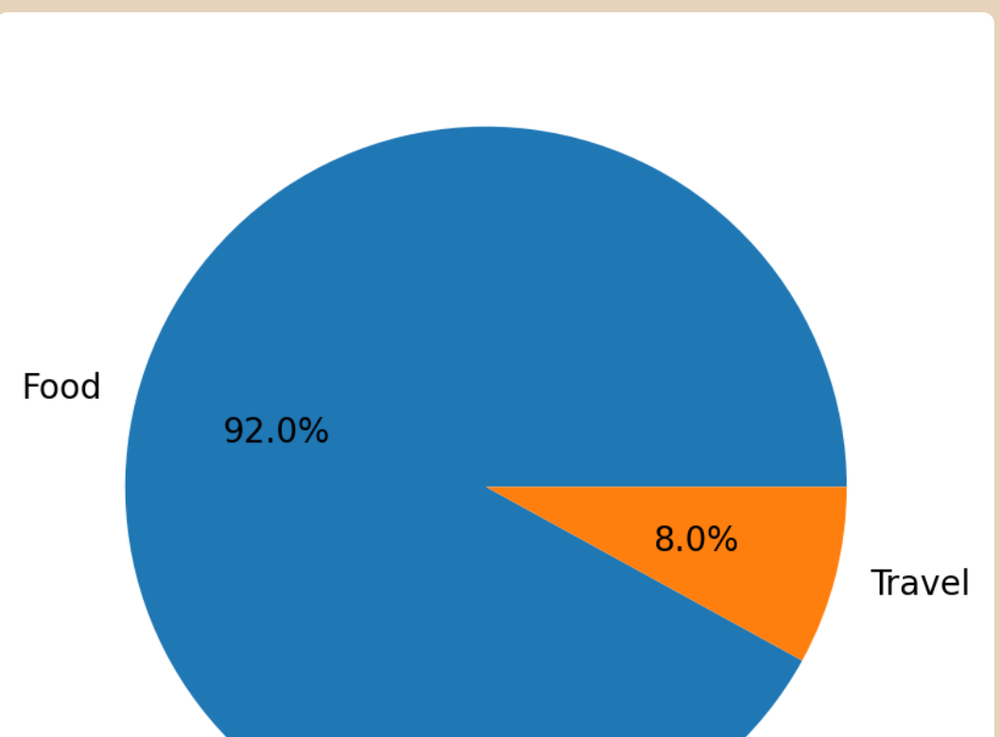
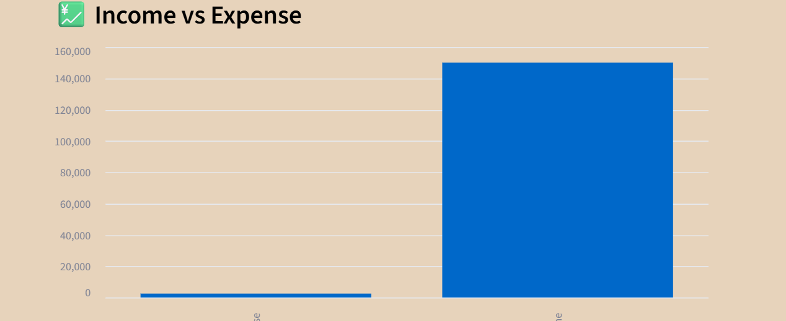
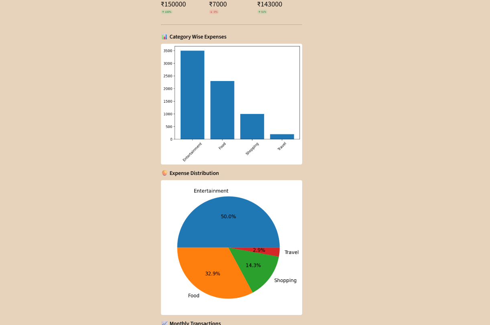
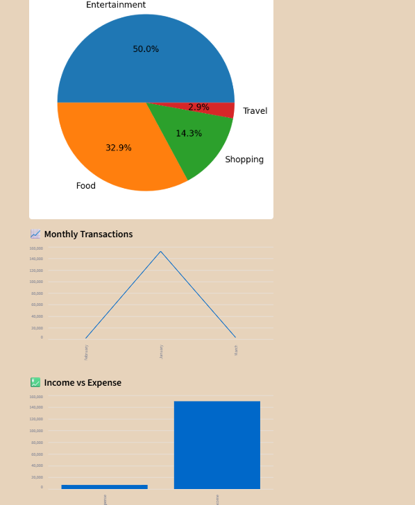


### Deploy to Streamlit Cloud (Free)
1. Push your code to GitHub
2. Go to [share.streamlit.io](https://share.streamlit.io)
3. Connect your GitHub repository
4. Set the main file as `app.py`
5. Add your environment secrets (MongoDB URI)
6. Click **Deploy**

Your app will be live at:
```
https://your-app-name.streamlit.app
```

### Alternative Deployment Options
| Platform | URL Pattern |
|----------|------------|
| Streamlit Cloud | `https://your-app.streamlit.app` |
| Railway | `https://your-app.railway.app` |
| Render | `https://your-app.onrender.com` |
| Heroku | `https://your-app.herokuapp.com` |

---

## 📊 MongoDB Collections Schema

### `users` Collection
```json
{
  "_id": "ObjectId",
  "username": "John Doe",
  "email": "john@example.com",
  "password": "$2b$12$hashed_password",
  "created_at": "2026-01-01T00:00:00Z"
}
```

### `transactions` Collection
```json
{
  "_id": "ObjectId",
  "user_id": "ObjectId",
  "type": "expense",
  "amount": 450.00,
  "category": "Food & Dining",
  "description": "Dinner at restaurant",
  "payment_method": "UPI",
  "date": "2026-05-27",
  "created_at": "2026-05-27T19:30:00Z"
}
```

### `budgets` Collection
```json
{
  "_id": "ObjectId",
  "user_id": "ObjectId",
  "category": "Food & Dining",
  "limit_amount": 6000.00,
  "month": 5,
  "year": 2026,
  "updated_at": "2026-05-01T00:00:00Z"
}
```

### `categories` Collection
```json
{
  "_id": "ObjectId",
  "name": "Food & Dining",
  "type": "expense",
  "icon": "🍕",
  "color": "#FF6B6B"
}
```

---

## 🤝 Contributing

1. Fork the repository
2. Create your feature branch (`git checkout -b feature/AmazingFeature`)
3. Commit your changes (`git commit -m 'Add some AmazingFeature'`)
4. Push to the branch (`git push origin feature/AmazingFeature`)
5. Open a Pull Request

---

## 📄 License

This project is licensed under the MIT License — see the [LICENSE](LICENSE) file for details.

---

## 👨‍💻 Author

**  Rishi Munda**
- GitHub: [GitHub](https://github.com/Rishi50-IT)
- Email: rishimunda50@gmail.com
- LinkedIn: [ LinkedIn](https://linkedin.com/in/rishi-munda-a88b80224)

---

## 🙏 Acknowledgements

- [Streamlit Documentation](https://docs.streamlit.io)
- [MongoDB Atlas](https://www.mongodb.com/atlas)
- [Plotly Express](https://plotly.com/python/plotly-express/)
- [PyMongo Documentation](https://pymongo.readthedocs.io)

---

<div align="center">
  <p>Made with ❤️ using Python Streamlit & MongoDB</p>
  <p>⭐ Star this repo if you found it helpful!</p>
</div>

